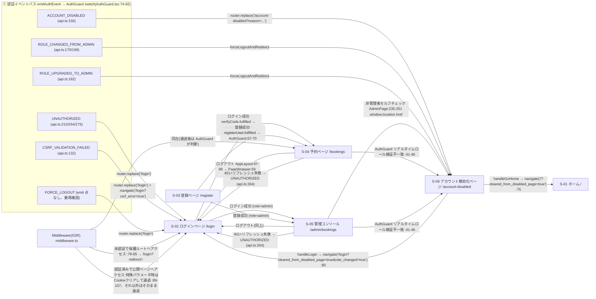

# イベント駆動画面遷移図(booking-frontend)（frontend-screen-transition）

> 本ドキュメントは ワークスペース `docs/frontend-screen-transition.md` の日本語版であり、文中の file:line アンカーは booking-frontend コミット `2627080a1570eb054292b1c6b0900d0f547bd1b2` 時点の実測値である。

> 対象: **イベント**を主軸とする画面遷移。画面番号は `docs/frontend-pages-inventory.md` と完全に一致(S-01〜S-06)
> イベントの 3 つの発生源: ①認証イベントバス(authEvents.ts) ②API レスポンスイベント(api.ts インターセプター) ③ページ操作/権限イベント(HOC/AuthGuard/middleware/コンポーネントのボタン)
> すべての `file:line` は本セッションで実測

## 1. 概要

- 画面ノード(inventory §2 と一致): S-01 ホーム `/`、S-02 ログインページ `/login`、S-03 登録ページ `/register`、S-04 予約ページ `/bookings`、S-05 管理コンソール `/admin/bookings`、S-06 アカウント無効化ページ `/account-disabled`。
- 遷移のトリガーは URL 直接入力ではなくイベントである。イベントの発生源は 3 種類:
  1. **認証イベントバス**: `src/utils/authEvents.ts` が 6 種類のイベントを定義(`:2-8`)、`emitAuthEvent`(`:18-24`)が発火し、`AuthGuard` が登録した handler(`AuthGuard.tsx:74-92` の switch)が消費して遷移する;
  2. **API レスポンスイベント**: `src/services/api.ts` のレスポンスインターセプター(`:100-281`)がステータスコード/エラー文言に応じてイベントを emit するか、直接 `navigate`/`window.location` を実行する;
  3. **ページ操作/権限イベント**: ログイン/登録成功後の AuthGuard ルート保護、ログアウトボタン、アカウント無効化ページのボタン、AdminPage のロールセルフチェック、middleware による SSR リダイレクト。
- 遷移の 2 つのチャネル: ほとんどのイベントは「イベント emit → AuthGuard switch → `router.replace`」。このほかに `navigate()` の直接呼び出し(`AuthGuard.tsx:20-24` で登録。`window.location.href` へフォールバック。`navigation.ts:12-19`)および `window.location.href` によるハードリダイレクト(`AdminPage.tsx:251`)がある。

## 2. イベント 3 発生源の接続詳細

### 2.1 認証イベントバス(6 種類のイベント)

定義: `src/utils/authEvents.ts:2-8`(`AuthEventType` ユニオン型)。発火 `emitAuthEvent`(`:18-24`。handler 未登録時は console.warn)。消費 `AuthGuard.tsx:74-92`。

| イベント | emit 点(実測) | 消費/処理点 | 遷移先画面 | 備考 |
|---|---|---|---|---|
| `UNAUTHORIZED` | `api.ts:210`(リフレッシュリクエスト自体の失敗)、`api.ts:264`(401 リフレッシュ失敗)、`api.ts:275`(リトライ済み 401) | `AuthGuard.tsx:78-82` `case 'UNAUTHORIZED'` → `router?.replace('/login')` | S-02 ログインページ | 3 箇所の emit はいずれも同時に `navigate('/login')` を実行(`api.ts:210,264,275`) |
| `ACCOUNT_DISABLED` | `api.ts:156`(バックエンドが「`用户账户已被禁用`」(ユーザーアカウントは無効化されています)を返す。payload `{ reason: userStatus }`) | `AuthGuard.tsx:83-85` → `router?.replace('/account-disabled?reason=' + (reason \|\| 'INACTIVE'))` | S-06 アカウント無効化ページ | reason は同時に `sessionStorage.accountDisabledReason` にも書き込まれ(`api.ts:153`)、S-06 の文言で読み取られる |
| `ROLE_CHANGED_FROM_ADMIN` | `api.ts:170`(「`用户角色已降级，请重新登录`」(ユーザーロールが降格されました。再ログインしてください))、`api.ts:199`(403「`仅管理员可操作`」(管理者のみ操作可能)) | `AuthGuard.tsx:86-89` `case 'ROLE_CHANGED_FROM_ADMIN'` → `forceLogoutAndRedirect(type)` | S-06(reason=ROLE_CHANGED_FROM_ADMIN) | `forceLogoutAndRedirect`(`AuthGuard.tsx:27-38`)は先に logoutUser API 呼び出し + ストレージクリアを行い、その後 `router?.replace('/account-disabled?reason=...')`(`:37`)を実行 |
| `ROLE_UPGRADED_TO_ADMIN` | `api.ts:182`(「`用户角色已升级，请重新登录`」(ユーザーロールが昇格されました。再ログインしてください)) | `AuthGuard.tsx:86-89` 同一 case → `forceLogoutAndRedirect(type)` | S-06(reason=ROLE_UPGRADED_TO_ADMIN) | 同上。S-06 は「`您的账户已升级为管理员`」(アカウントは管理者に昇格されました)の文言を表示(`account-disabled.tsx:36-41`) |
| `CSRF_VALIDATION_FAILED` | `api.ts:132`(403 +「`CSRF token 验证失败`」(CSRF token 検証失敗)) | `AuthGuard.tsx:79` `case 'CSRF_VALIDATION_FAILED'` → `router?.replace('/login')` | S-02 ログインページ | emit の前に `sessionStorage.csrfValidationFailed` を設定し(`api.ts:129`)、`api.ts:133` で `navigate('/login?csrf_error=true')` を実行。フラグは `_app.tsx:44-46,59` で、ログイン直後の認証初期化をスキップするために使用 |
| `FORCE_LOGOUT` | **emit 点は実測されず**(grep 全 src では `authEvents.ts:8` の定義と `AuthGuard.tsx:80` の処理のみ) | `AuthGuard.tsx:80` `case 'FORCE_LOGOUT'` → `router?.replace('/login')` | S-02 ログインページ | イベントタイプは存在し消費されるが、現行ソースに発火元は一切ない。要再確認 |

### 2.2 API レスポンスイベントチェーン(api.ts インターセプター `:100-281`)

| トリガー条件 | 処理(file:line) | イベント/遷移 | 遷移先画面 |
|---|---|---|---|
| 任意の書き込みリクエストが CSRF token を添付(リクエストインターセプター) | `api.ts:79-95` が `csrf_token` Cookie から読み取り `X-CSRF-Token` ヘッダーへ書き込み | —(前提処理、遷移なし) | — |
| レスポンス 403 かつ文言「`CSRF token 验证失败`」(CSRF token 検証失敗) | `api.ts:122-137` | `clearAuthData`(`:124`)+ `emitAuthEvent('CSRF_VALIDATION_FAILED')`(`:132`)+ `navigate('/login?csrf_error=true')`(`:133`) | S-02 |
| レスポンス文言「`用户账户已被禁用`」(ユーザーアカウントは無効化されています) | `api.ts:141-162` | `clearAuthData`(`:143`)+ `emitAuthEvent('ACCOUNT_DISABLED', { reason })`(`:156`) | S-06 |
| レスポンス文言「`用户角色已降级，请重新登录`」(ユーザーロールが降格されました。再ログインしてください) | `api.ts:166-174` | `clearAuthData`(`:167`)+ `emitAuthEvent('ROLE_CHANGED_FROM_ADMIN')`(`:170`) | S-06 |
| レスポンス文言「`用户角色已升级，请重新登录`」(ユーザーロールが昇格されました。再ログインしてください) | `api.ts:178-186` | `clearAuthData`(`:179`)+ `emitAuthEvent('ROLE_UPGRADED_TO_ADMIN')`(`:182`) | S-06 |
| レスポンス 403 かつ文言「`仅管理员可操作`」(管理者のみ操作可能) | `api.ts:190-205` | `clearAuthData`(`:192`)+ `emitAuthEvent('ROLE_CHANGED_FROM_ADMIN')`(`:199`) | S-06 |
| リフレッシュ token リクエスト自体の失敗(`/auth/refresh`) | `api.ts:208-213` | `emitAuthEvent('UNAUTHORIZED')` + `navigate('/login')`(`:210`) | S-02 |
| ログイン/登録/検証コード/ログアウト系 API の 401 | `api.ts:217-224` | 直接 reject。リフレッシュと遷移は**発火しない**(認証失敗は業務エラー) | — |
| 401 かつ未リトライかつ `X-Skip-Auth-Redirect` 未付与 | `api.ts:229-270` | リフレッシュロック `isRefreshing`/`failedQueue`(`:34-35,230-243`)。`POST /auth/refresh`(`:251`)。成功 → `processQueue(null)` + 元リクエストをリトライ(`:254-257`)。失敗 → `processQueue(refreshError)` + `emitAuthEvent('UNAUTHORIZED')` + `navigate('/login')`(`:263-265`) | S-02(リフレッシュ失敗時のみ) |
| 401 かつリトライ済み(`_retry`) | `api.ts:273-277` | `emitAuthEvent('UNAUTHORIZED')` + `navigate('/login')`(`:275`) | S-02 |
| `X-Skip-Auth-Redirect: true` 付きリクエストの 401 | `api.ts:226` | リフレッシュと遷移ロジックをスキップ | — |

### 2.3 ページ操作/権限イベント

| イベント | トリガー点(file:line) | 処理チェーン | 遷移先画面 |
|---|---|---|---|
| ログイン成功(検証コード検証通過) | `verifyCode.fulfilled` → `userSlice.ts:200-213` が `currentUser`/`authInitialized` を書き込み | AuthGuard 初期ルート保護 `AuthGuard.tsx:67-70`: 認証済みで公開ページへアクセス → `userRole === 'admin' ? '/admin/bookings' : '/bookings'`(router.replace) | S-04 / S-05 |
| 登録成功 | `registerUser.fulfilled` → `userSlice.ts:161-173` | 同上 `AuthGuard.tsx:67-70` | S-04 / S-05 |
| ログアウトボタン(上部ナビゲーション) | `AppLayout.tsx:97-99` Button onClick={onLogout} | `PageWrapper.tsx:40-61`: logoutUser API → `dispatch(logout())` → ストレージクリア → `navigate('/login')`(`:59`) | S-02 |
| S-06「ログインページへ戻る」ボタン | `account-disabled.tsx:78-81` | `performFullLogout`(`:51-71`)+ `navigate('/login?cleared_from_disabled_page=true&role_changed=true')`(`:80`) | S-02(middleware は `middleware.ts:94-107` で Cookie クリアして通過許可) |
| S-06「ホームへ戻る」ボタン | `account-disabled.tsx:73-76` | `performFullLogout` + `navigate('/?cleared_from_disabled_page=true')`(`:75`)| S-01(middleware `:94` で通過許可。**AuthGuard `:98-100` により認証済みがホームではローディング状態の描画のみで遷移しない**) |
| 非管理者が管理コンソールへアクセス | `AdminPage.tsx:231-257`(useEffect で `currentUser?.userType !== 'admin'` を検出。`:235`) | ストレージクリア(`:242-245`)+ `sessionStorage.setItem('accountDisabledReason','ROLE_CHANGED_FROM_ADMIN')`(`:248`)+ `window.location.href = '/account-disabled?reason=ROLE_CHANGED_FROM_ADMIN'`(`:251`、ハードリダイレクト) | S-06 |
| 未認証で保護ルートへアクセス(クライアント) | AuthGuard 初期ルート保護 `AuthGuard.tsx:55-59` | `rule.redirectUnauthenticated || '/login'`(`:56`)で `router.replace` | S-02 |
| 認証済みだがロール不一致(クライアント) | `AuthGuard.tsx:61-65` | `rule.redirectForbidden || '/account-disabled?reason=ROLE_CHANGED_FROM_ADMIN'`(`:62`) | S-06 |
| リアルタイムロール検証(クライアント、双方向) | `AuthGuard.tsx:41-46` | `hasRoutePermission(pathname, userRole)` 失敗 → `forceLogoutAndRedirect('ROLE_CHANGED_FROM_ADMIN')`(`:44`) | S-06 |
| 未認証で `/admin/*` にアクセス(SSR 層) | `middleware.ts:78-80` | `createLoginRedirect`(`:41-55`): `/login?redirect=<元のパス>`、かつ Cookie クリア(`:54`) | S-02 |
| 未認証でその他の非公開ルートにアクセス(SSR 層) | `middleware.ts:83-85` | 同上 | S-02 |
| 認証済みで `/login` `/register` `/account-disabled` にアクセス(SSR 層) | `middleware.ts:89-117` | 特殊パラメータ(`csrf_error`/`cleared_from_disabled_page`/`role_changed`/`reason=ROLE_*`)付き → Cookie クリアして通過許可(`:99-107`)。それ以外はそのまま通過許可し、クライアントの AuthGuard が処理(`:109-116`) | 通過後はクライアントガードが判断(S-04/S-05/S-06) |
| withAuth / withAdmin によるインターセプト | `withAuth.tsx:10-20` / `withAdmin.tsx:10-20` | Spinner(未初期化)または null(未認証/非 admin)の描画のみで**自身は遷移しない**。フォールバックは AuthGuard が担う | —(直接の遷移なし) |

## 3. Mermaid 画面遷移図

## 4. イベント → 画面遷移表(集計)

| # | イベント | トリガー点(file:line) | 消費/処理点(file:line) | 遷移先画面 | 備考 |
|---|---|---|---|---|---|
| 1 | `UNAUTHORIZED` | `api.ts:210`(refresh リクエスト失敗)/ `:264`(リフレッシュ失敗)/ `:275`(リトライ後の 401) | `AuthGuard.tsx:78-82` | S-02 | emit 時に同時に `navigate('/login')` を実行 |
| 2 | `ACCOUNT_DISABLED` | `api.ts:156` | `AuthGuard.tsx:83-85` | S-06 | reason はレスポンスの `userStatus`/header から取得(`api.ts:148-150`) |
| 3 | `ROLE_CHANGED_FROM_ADMIN` | `api.ts:170` / `:199` | `AuthGuard.tsx:86-89` → `forceLogoutAndRedirect`(`:27-38`) | S-06(reason=ROLE_CHANGED_FROM_ADMIN) | AdminPage のセルフチェック `:251` のハードリダイレクトも参照 |
| 4 | `ROLE_UPGRADED_TO_ADMIN` | `api.ts:182` | `AuthGuard.tsx:86-89` → `forceLogoutAndRedirect` | S-06(reason=ROLE_UPGRADED_TO_ADMIN) | S-06 の文言 `account-disabled.tsx:36-41` |
| 5 | `CSRF_VALIDATION_FAILED` | `api.ts:132` | `AuthGuard.tsx:79` + `navigate('/login?csrf_error=true')`(`api.ts:133`) | S-02 | `csrfValidationFailed` フラグ `_app.tsx:44-46,59` |
| 6 | `FORCE_LOGOUT` | **emit 点は実測されず** | `AuthGuard.tsx:80` | S-02 | 定義 `authEvents.ts:8`。要再確認 |
| 7 | ログイン成功 | `verifyCode.fulfilled`(`userSlice.ts:200-213`) | `AuthGuard.tsx:67-70` | S-04(customer)/ S-05(admin) | 明示的な navigate なし。AuthGuard が一元的に遷移 |
| 8 | 登録成功 | `registerUser.fulfilled`(`userSlice.ts:161-173`) | `AuthGuard.tsx:67-70` | S-04 / S-05 | 同上 |
| 9 | ログアウト | `AppLayout.tsx:97-99`(ログアウトボタン) | `PageWrapper.tsx:40-61`。`navigate('/login')` `:59` | S-02 | HttpOnly Cookie のクリアは logoutUser API 経由 |
| 10 | S-06 からログインへ戻る | `account-disabled.tsx:78-81` | `performFullLogout` `:51-71` + `navigate` `:80` | S-02 | middleware `:94-107` が Cookie をクリアして通過許可 |
| 11 | S-06 からホームへ戻る | `account-disabled.tsx:73-76` | `performFullLogout` + `navigate` `:75` | S-01 | 認証済みで '/' にアクセスするとローディング状態の描画のみ(`AuthGuard.tsx:98-100`)。後続の遷移なし。AuthGuard `:67-70` の遷移は /login、/register にのみ適用 |
| 12 | 非管理者が管理コンソールへアクセス | `AdminPage.tsx:235`(useEffect セルフチェック) | `AdminPage.tsx:242-251` | S-06 | `window.location.href` ハードリダイレクト(`:251`) |
| 13 | 未認証で保護ルートへアクセス(クライアント) | `AuthGuard.tsx:55-59` | `router.replace(redirectUnauthenticated || '/login')` | S-02 | redirectForbidden のデフォルト `routePermissions.ts:15,21,29,35` |
| 14 | ロール不一致(クライアント) | `AuthGuard.tsx:61-65` | `router.replace(redirectForbidden)` | S-06 | デフォルト `'/account-disabled?reason=ROLE_CHANGED_FROM_ADMIN'`(`:62`) |
| 15 | リアルタイムロール検証不一致 | `AuthGuard.tsx:41-46` | `forceLogoutAndRedirect('ROLE_CHANGED_FROM_ADMIN')` `:44` | S-06 | 双方向インターセプト(昇格/降格のいずれも発火) |
| 16 | 未認証で `/admin/*` にアクセス(SSR) | `middleware.ts:78-80` | `createLoginRedirect` `:41-55` | S-02(`?redirect=` パラメータ) | 同時に Cookie クリア `:54` |
| 17 | 未認証で非公開ルートにアクセス(SSR) | `middleware.ts:83-85` | 同上 | S-02 | matcher `:127-137` |
| 18 | 認証済みで公開ページへアクセス(SSR) | `middleware.ts:89-117` | 特殊パラメータ時は Cookie クリアして通過許可 `:99-107`。それ以外はそのまま通過許可 `:112-116` | 通過後は AuthGuard が判断(S-04/S-05/S-06) | クライアントガードとのピンポンリダイレクトを回避(コメント `:110`) |

## 5. コード根拠表

| 根拠 | file:line | 実測方法 |
|---|---|---|
| 6 種類のイベントタイプ定義 | `src/utils/authEvents.ts:2-8` | Read |
| emitAuthEvent 発火関数 | `src/utils/authEvents.ts:18-24` | Read |
| AuthGuard イベント switch | `src/components/providers/AuthGuard.tsx:74-92` | Read |
| forceLogoutAndRedirect | `src/components/providers/AuthGuard.tsx:27-38` | Read |
| 初期ルート保護/リアルタイムロール検証 | `AuthGuard.tsx:41-46, 49-71` | Read |
| navigate 登録とフォールバック | `src/utils/navigation.ts:8-19` | Read |
| api.ts の全 emitAuthEvent 点 | `src/services/api.ts:132,156,170,182,199,210,264,275` | grep -rn "emitAuthEvent" |
| api.ts の 401 リフレッシュチェーン | `src/services/api.ts:229-270` | Read |
| middleware リダイレクト | `src/middleware.ts:78-85, 89-117, 127-137` | Read |
| AdminPage の非管理者ハードリダイレクト | `src/components/pages/AdminPage.tsx:231-257` | Read |
| ログアウトチェーン | `PageWrapper.tsx:40-61` + `AppLayout.tsx:97-99` | Read |
| S-06 ボタンの navigate | `src/pages/account-disabled.tsx:73-81` | Read |
| FORCE_LOGOUT に emit 点なし | `src/` 全量 grep | grep -rn "FORCE_LOGOUT"(2 ヒットのみ: 定義+消費) |
| ログイン/登録成功時の currentUser 書き込み | `src/store/userSlice.ts:161-173, 200-213` | Read |

## 6. Verified-by

- `Verified-by: grep -rn "emitAuthEvent" src/ → api.ts:132/156/170/182/199/210/264/275 計 8 箇所 + authEvents.ts:18(定義)`
- `Verified-by: grep -rn "FORCE_LOGOUT" src/ → authEvents.ts:8(定義)、AuthGuard.tsx:80(消費)。emit 点なし`
- `Verified-by: grep -rn "navigate(" src/ → PageWrapper.tsx:59 / account-disabled.tsx:75,80 / api.ts:133,210,264,275(計 7 箇所)`
- `Verified-by: Read AuthGuard.tsx(108 行) → switch :77-90 の 6 case すべて実測`
- `Verified-by: Read api.ts(283 行) → インターセプター :100-281 全チェーン実測`
- `Verified-by: Read middleware.ts(137 行) → matcher :127-137 とリダイレクト :78-85 を実測`
- `Verified-by(書き込み整合性ゲート): test -s docs/frontend-screen-transition.md → PASS; wc -l → 165; head -n 1 → "# 事件驱动的画面遷移図(booking-frontend)"`
